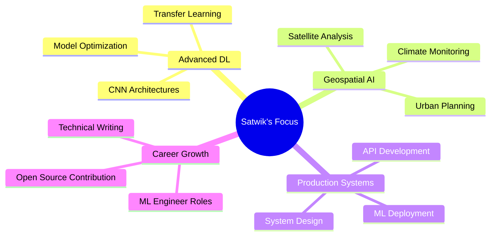

<div align="center">
  
# 👋 Hi, I'm Satwik Shreshth

### Software Developer | Machine Learning Engineer | Geospatial Tech Enthusiast

[](https://git.io/typing-svg)

[](https://linkedin.com/in/satwik-shreshth)
[](https://satwik-shreshth.github.io/Satwik-Portolio/)
[](mailto:satwikshreshth2002@gmail.com)
[](https://instagram.com/satwik_shreshth)


</div>

---

## 🚀 About Me

```python
class SatwikShreshth:
    def __init__(self):
        self.role = "MCA Student | Software Developer | ML Engineer"
        self.location = "Sikkim University, India"
        self.education = {"degree": "MCA", "cgpa": 8.25}
        self.interests = ["Deep Learning", "Computer Vision", "Geospatial AI", "Remote Sensing"]
        
    def current_status(self):
        return {
            "learning": ["Advanced CNN Architectures", "Geospatial Deep Learning"],
            "working_on": ["Production ML Systems", "Satellite Image Analysis"],
            "looking_for": ["ML Engineer Roles", "Software Development Opportunities"],
            "fun_fact": "Managed exam systems for 10,000+ candidates with 99.9% uptime! 🎯"
        }
```

🎓 **MCA Final Year** at Sikkim University (CGPA: 8.25/10)  
💼 **Ex-Technical Representative** at C-DAC ATC Delhi  
🛰️ **Remote Sensing & GIS Intern** at India Space Academy  
🔬 Passionate about building **data-driven solutions** that solve real-world problems  
🌱 Currently exploring **advanced deep learning architectures** and **geospatial AI**

---

## 🛠️ Tech Arsenal

<details open>
<summary><b>🔥 Core Technologies</b></summary>
<br>

**Programming Languages**


**Web Technologies**


</details>

<details open>
<summary><b>🤖 Machine Learning & AI</b></summary>
<br>

**Frameworks & Libraries**


**Data Science Tools**


</details>

<details open>
<summary><b>🌍 Geospatial Technologies</b></summary>
<br>


**Specializations:** Satellite Image Analysis • Spectral Analysis • Land Cover Classification • Water Body Mapping

</details>

<details open>
<summary><b>🗄️ Databases & Tools</b></summary>
<br>

**Databases**


**Developer Tools**


**Other Tools**


</details>

---

## 🎯 Featured Projects

<div align="center">

### 🎨 [Image-to-Sketch Generation using U-Net CNN](https://github.com/satwik-shreshth/Image_To_Sketch)

[](https://github.com/satwik-shreshth/Image_To_Sketch)


</div>

Deep learning application converting RGB photographs to pencil-style sketches using **U-Net architecture**
- ✅ Achieved **85%+ visual similarity** using SSIM metric
- ✅ Custom **MAE-SSIM hybrid loss function** for optimal edge preservation
- ✅ **Real-time inference** under 2 seconds with Streamlit deployment
- 🛠️ **Tech:** Python, TensorFlow/Keras, OpenCV, NumPy

---

<div align="center">

### 🛰️ [Satellite-Based Land Use Classification](https://github.com/satwik-shreshth/LULC_Classification)

[](https://github.com/satwik-shreshth/LULC_Classification)


</div>

Multi-class land cover classification from **Landsat-8 satellite imagery**
- ✅ **92% accuracy** across 6 land cover classes using Random Forest
- ✅ Engineered spectral indices: **NDVI, NDWI, NDBI**
- ✅ Processed **500+ km²** of satellite imagery
- 🛠️ **Tech:** Python, Google Earth Engine, Scikit-learn, QGIS

---

<div align="center">

### 💧 [NDWI-Based Water Body Mapping](https://github.com/satwik-shreshth/NDWI_Chilika)

[](https://github.com/satwik-shreshth/NDWI_Chilika)


</div>

Automated water resource monitoring for **Chilika Lake** using NDWI algorithm
- ✅ Multi-temporal **Sentinel-2 data** processing
- ✅ Seasonal variation tracking and drought pattern analysis
- ✅ Georeferenced maps for environmental impact studies
- 🛠️ **Tech:** Google Earth Engine, QGIS, Python

---

<div align="center">

### 🌐 [Personal Portfolio Website](https://satwik-shreshth.github.io/Satwik-Portolio/)

[](https://satwik-shreshth.github.io/Satwik-Portolio/)
[](https://github.com/satwik-shreshth/Satwik-Portolio)

</div>

Fully responsive portfolio with **modern UI/UX** design
- ✅ Cross-browser compatibility and mobile optimization
- ✅ Interactive project showcases and dynamic content
- 🛠️ **Tech:** HTML5, CSS3, JavaScript

---

## 📊 GitHub Analytics

<div align="center">
  


</div>

<div align="center">
  


</div>

<div align="center">

### 🏆 Top Contributed Repositories
  


</div>

---

## 💼 Professional Experience

<table>
<tr>
<td width="50%">

### 🏢 Technical Representative
**C-DAC ATC Delhi** • *Feb 2024 - Aug 2024*

- Managed systems for **10,000+ candidates**
- Achieved **99.9% uptime** during national exams
- Zero data loss across multiple exam centers
- Real-time troubleshooting under strict SLAs

</td>
<td width="50%">

### 🛰️ Remote Sensing & GIS Intern
**India Space Academy** • *July 2025 - Aug 2025*

- Satellite image analysis & classification
- ML-based land cover mapping
- **40% faster** geospatial workflows
- Environmental monitoring applications

</td>
</tr>
</table>

---

## 🎓 Certifications & Learning

<div align="center">

| 📜 Certification | 🏛️ Institution | ⏱️ Duration |
|-----------------|----------------|------------|
| **Computer Aided Decision Systems using Big Data Analytics** | NPTEL | 12 weeks |
| **Ethical Hacking** | NPTEL | 12 weeks |
| **Internet of Things** | NPTEL | 12 weeks |

</div>

**Key Topics Covered:** Predictive Modeling • Data Mining • Network Security • Penetration Testing • IoT Architecture • Sensor Networks

---

## 🏆 Achievements & Leadership

<div align="center">


</div>

🏅 **Bihar Contingent Representative** at 23rd National Youth Festival, Lucknow (2020)  
🎪 **Cultural Committee Member** at Sikkim University (SUSA)  
🤝 **NSS Volunteer** with 100+ hours of community service

---

## 📈 Contribution Graph

<div align="center">

[](https://github.com/satwik-shreshth)

</div>

---

## 🎯 Current Focus



---

## 💬 Fun Fact

<div align="center">

> *"I once ensured 99.9% uptime for examination systems handling 10,000+ candidates simultaneously. Now I'm building AI systems that can analyze entire cities from space! 🛰️"*

</div>

---

<div align="center">

### 📫 Let's Connect and Build Something Amazing!

[](https://linkedin.com/in/satwik-shreshth)
[](https://satwik-shreshth.github.io/Satwik-Portolio/)
[](mailto:satwikshreshth2002@gmail.com)

---

### 💖 Thanks for visiting! Feel free to explore my repositories and don't forget to ⭐ your favorites!


*"Building the future, one commit at a time"* 🚀

</div>
